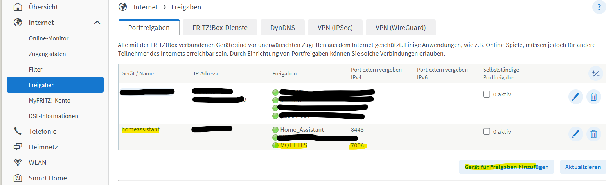
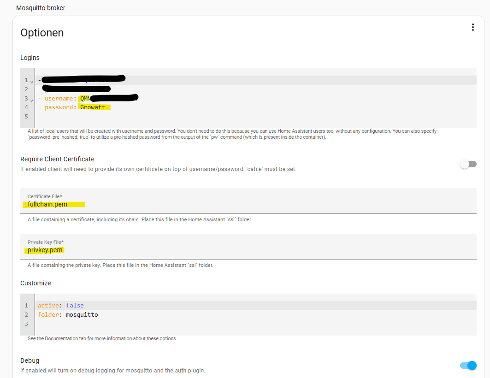
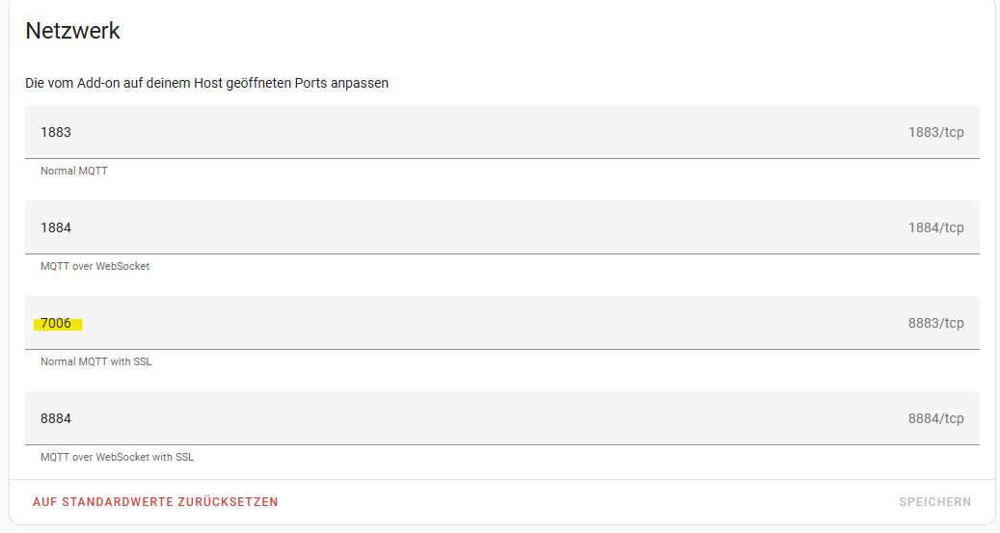
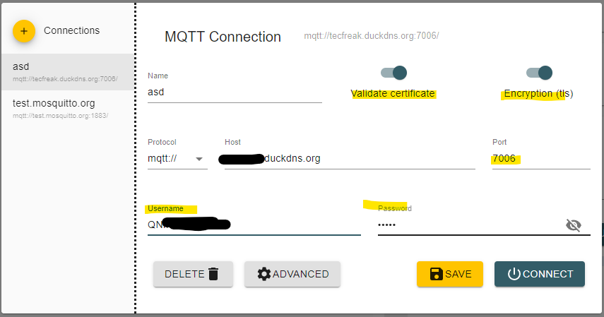

# Configuration

### 1. Prerequisites

You have a valid Let’s Encrypt certificate.

You have the following files:
- `fullchain.pem` – contains server + intermediate certificates
- `privkey.pem` – your private key

These are usually located in `/etc/letsencrypt/live/<your-domain>/`

Our setup needs the full trust chain including the root. Head over to the [Certificates Guide](CERTIFICATES.md) for details:
```bash
curl -o root.pem https://letsencrypt.org/certs/isrgrootx2.pem
cat fullchain.pem root.pem > chain-full.pem
```

So now you have:
- `chain-full.pem` (cert chain including ISRG Root X2 certificate)
- `privkey.pem` (private key)

### 2. Mosquitto TLS Configuration

Create a Mosquitto config file:
```
# Listener on port 7006 for TLS
listener 7006

# Path to certs and key
certfile /mosquitto/certs/chain-full.pem
keyfile /mosquitto/certs/privkey.pem
cafile /mosquitto/certs/root.pem

# Allow anonymous connections
allow_anonymous true
```

### 3. Run the Mosquitto TLS Container

Make sure your volume mounts place the certs and config properly:
```
/mosquitto
├── config
│   └── mosquitto.conf
├── certs
│   ├── chain-full.pem
│   ├── privkey.pem
│   └── root.pem
```

Now run the Mosquitto container like this and check the logs for any errors:
```bash
docker run --detach \
  --name mosquitto-tls \
  --publish 7006:7006 \
  --volume ./mosquitto-tls/conf:/mosquitto/config \
  --volume ./mosquitto-tls/data:/mosquitto/data \
  --volume ./mosquitto-tls/certs:/mosquitto/certs \
  docker.io/library/eclipse-mosquitto:latest
```

### 4. Setup the Growatt Device

Open the ShinePhone app and tap on `Devices List`. Select the inverter you want to configure for your own MQTT server and tap `Configure`.
Make sure you are within Bluetooth range and the inverter is powered on. Configuration cannot be performed at night when the inverter is off.


Next, tap `Advanced` and open the `Server settings` tab. Tap the lock icon and enter the password, which is based on the current date:

`growatt<YYYYMMDD>`

Then tap `Yes`.


Once unlocked, the settings can be modified. For `Server domain name/IP`, choose `Manual` and enter the address of your Mosquitto instance configured for TLS. Do the same for the `Port` field.
Return to the main configuration screen and tap `Configure immediately`. You can ignore the final step when the app attempts to connect to the Growatt cloud. After that, you may close the app.


Additionally: Block the device from accessing the internet after configuration to prevent it from reverting settings or syncing with the cloud.

### 5. Run the GroBro HA Bridge

This example demonstrates how to run the GroBro HA bridge with a dedicated TLS-secured Mosquitto instance for the Growatt device as the source, and a separate MQTT broker for Home Assistant as the target:
```bash
docker run --detach \
  --name grobro-bridge \
  --env SOURCE_MQTT_HOST=<source-mqtt-host> \
  --env SOURCE_MQTT_PORT=<source-mqtt-port> \
  --env SOURCE_MQTT_TLS=true \
  --env TARGET_MQTT_HOST=<target-mqtt-host> \
  --env TARGET_MQTT_PORT=<target-mqtt-port> \
  ghcr.io/robertzaage/grobro:latest
```

### Environment Variable Reference

| Variable             | Required | Description                                                                 |
|----------------------|----------|-----------------------------------------------------------------------------|
| `SOURCE_MQTT_HOST`   | ✅ Yes   | Hostname or IP of the source MQTT broker (for Growatt)                     |
| `SOURCE_MQTT_PORT`   | ✅ Yes   | Port number of the source MQTT broker                                      |
| `SOURCE_MQTT_TLS`    | ❌ No    | Set to `true` to enable TLS without certificate validation                 |
| `SOURCE_MQTT_USER`   | ❌ No    | Username for the source MQTT broker (if authentication is required)        |
| `SOURCE_MQTT_PASS`   | ❌ No    | Password for the source MQTT broker                                        |
| `TARGET_MQTT_HOST`   | ✅ Yes   | Hostname or IP of the target MQTT broker (for Home Assistant)              |
| `TARGET_MQTT_PORT`   | ✅ Yes   | Port number of the target MQTT broker                                      |
| `TARGET_MQTT_TLS`    | ❌ No    | Set to `true` to enable TLS without certificate validation                 |
| `TARGET_MQTT_USER`   | ❌ No    | Username for the target MQTT broker (if authentication is required)        |
| `TARGET_MQTT_PASS`   | ❌ No    | Password for the target MQTT broker                                        |
| `MQTT_CLIENT_SUFFIX` | ❌ No    | Optional suffix appended to all MQTT client IDs (grobro-ha and grobro-grobro). Allows running multiple GroBro instances in parallel against the same MQTT broker (e.g. prod, test). |
| `HA_BASE_TOPIC`      | ❌ No    | Base MQTT topic used for Home Assistant auto-discovery and sensor states   |
| `GROWATT_CLOUD`      | ❌ No    | Set to `true` to redirect messages to and from the Growatt Cloud. This is turned off by default. Supports a comma-separated list of device serials (e.g. `123456789,987654321`) for selective forwarding. |
| `GROWATT_CLOUD_CONFIG_FILTER`  | ❌ No | Set to `true` to prevent forwarding config messages. This protects the datalogger from remote setting changes initiated by the Growatt Cloud. |
| `LOG_LEVEL`          | ❌ No    | Sets the logging level to either `ERROR`, `DEBUG`, or `INFO`. If not set `ERROR` is used. |
| `DUMP_MESSAGES`      | ❌ No    | Dumps every received messages into `/dump` for later in-depth inspection. |
| `DEVICE_TIMEOUT` | ❌ No | Set the timeout in seconds for device communication. Default is `0` (disabled). Note: This must be greater than 0 for any availability/online tracking to work. Recommended: `300`+ seconds. After this time without data, the device is considered "offline." |
| `AVAILABILITY_SENSOR` | ❌ No | Requires `DEVICE_TIMEOUT > 0`. Set to `true` to expose availability as a dedicated `online` binary sensor. If `false` (default), the device and all its entities will be marked as "unavailable" (grayed out) in Home Assistant when the timeout is reached. |
| `MAX_SLOTS`     | ❌ No    | Set max available Slots for Battery configuration (Noah = max 9) |
| `MAX_BAT`       | ❌ No    | Limits how many battery packs appear in Home Assistant (default `4`). Example: `MAX_BAT=1` shows only the first battery (Bat1). Set this to match the actual number of batteries you have. |
| `PUBLISH_SENSORS_RETAINED`     | ❌ No    | Set to `true` to publish sensor states with the MQTT retain flag enabled. Default is `false`.  |

# Example Setup with DuckDNS and HA-MQTT

### 1. Set up DynDNS Address and Certificates
There are many guides available on how to do this. I use a DuckDNS address and the DuckDNS add-on to create the certificates. Just follow their guide. Your certificate should then be located at `/ssl/fullchain.pem` and your key at `/ssl/privkey.pem`.

### 2. Open Port in Your Router and Redirect to Home Assistant
If you completed step 1, you should already know how to do this. Open port **7006** and redirect it to your Home Assistant instance. Example on a FritzBox:


(It might also be possible to use the default MQTT TLS port **8883**. In that case, you must also change the port in the ShinePhone app as described in step 4 of the configuration guide above. Alternatively, you can open external port **7006** and redirect it internally to **8883** — there are many ways to set it up 😉.)

### 3. Set up HA-MQTT
You just need to create a new user.
The username must be the serial number of your inverter. (If you are unsure, enable debug logging and check the logs while reconfiguring your inverter or Noah. You should see a line like `"checking auth cache for <username>"` in the logs.)

The password is **Growatt**.

Make sure the certificate names from step 1 are correctly configured:


Start your MQTT server on port **7006** (or on the default TLS port, as described above):


### 4. Check If Everything Works
You can use MQTT Explorer (https://github.com/thomasnordquist/MQTT-Explorer) for this.  
Make sure that **Validate certificate** and **Encryption** are enabled.  
If you can log in, everything is working correctly!


### 5. Optional: DNS Rewrite
To stay fully local, you can set up a DNS server (like AdGuard) to rewrite your `*.duckdns.org` address to the IP of your Home Assistant instance. The certificates will remain valid.


# Hardware Safety & Best Practices (Nexa 2000 & NOAH 2000)

### 1. High-Frequency Modbus Writing (Shadow RAM)
A common concern for users creating dynamic "Zero Export" automations in Home Assistant is that updating power limits every few seconds might destroy the device's Flash/EEPROM memory. 

According to internal Growatt R&D information, **high-frequency Modbus writes for dynamic power control are 100% hardware-safe**, provided you use the Time Slot registers. 

Both the Nexa 2000 and NOAH 2000 utilize a highly optimized **"Shadow RAM / Lazy Write"** mechanism. When GroBro sends a Modbus write command to the power settings, the MCU immediately applies this value to the volatile RAM, adjusting the output instantly *without* triggering physical EEPROM erase/write cycles. The system only commits these RAM values into the non-volatile EEPROM during a graceful system shutdown. Therefore, updating parameters like `slot1_power` every 30 seconds generates literally zero wear on the flash memory over the lifetime of the device.

### 2. Recommended "Zero Export" Setup via Home Assistant
To ensure a reliable and clean local control loop without relying on cloud APIs, the following setup is highly recommended by Growatt engineers for HA users:

**The Fail-Safe Baseline (Do this once):**
*   Set `default_power` (Reg 322) to a conservative, fixed value (e.g., 100W or 150W). 
*   *Why?* Because dynamic values are only stored in RAM, a sudden power loss will wipe them. If the device reboots and Home Assistant is offline, the inverter will safely fall back to this basic household load baseline stored in the EEPROM.

**Configure Static Slot Parameters (Do this once):**
To keep Modbus traffic clean and reduce unnecessary bus load, configure the static parameters on Slot 1 just once:
*   `slot1_start_time` (Reg 254) = 00:00
*   `slot1_end_time` (Reg 255) = 23:59
*   `slot1_mode` (Reg 256) = 0 (Load First)
*   `slot1_enabled` (Reg 258) = 1 (ON)

**The Dynamic Control (Automation Loop):**
*   Let your Home Assistant automation continuously update **only** `slot1_power` (Reg 257) based on your local smart meter readings.

### 3. Important Safety Warning Regarding AC Charging (Nexa 2000)
Currently, dynamic adjustment of AC charging power (up to 700W) is handled entirely internally by the MCU via a closed-loop algorithm based on grid conditions. **There is no exposed Modbus register for third-party control over the AC charging limit.** 

*   Do **not** attempt to reverse-engineer or force write custom values to the charging controller limits. 
*   Accidentally bypassing the native BMS and charging electronics limits can result in catastrophic hardware failure, severe thermal runaway, or an explosion/fire hazard. Let the native electronics make the final call on charging. 

*(Note: The technical insights in this section were provided by a Growatt employee acting out of personal enthusiasm for the Home Assistant community. Growatt does not officially support this project at this time, and these insights do not represent official company directives).*
