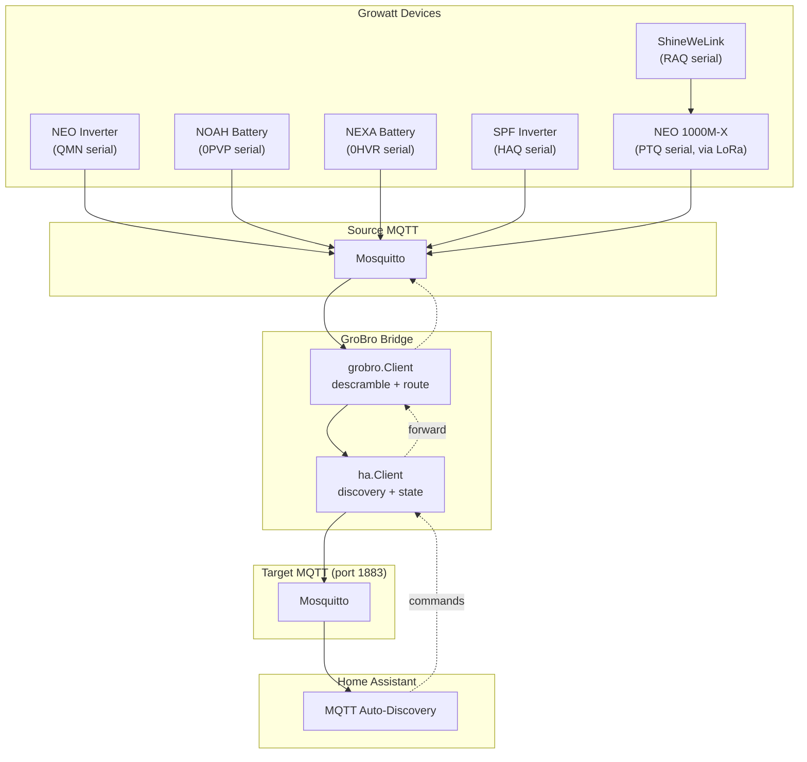

# GroBro — Developer Documentation

## Table of Contents

1. [Architecture Overview](#1-architecture-overview)
2. [Message Protocol](#2-message-protocol)
3. [Register System](#3-register-system)
4. [Extending GroBro](#4-extending-grobro)
5. [HA MQTT Discovery](#5-ha-mqtt-discovery)
6. [Testing](#6-testing)
7. [CI / CD and Tooling](#7-ci--cd-and-tooling)
8. [Debugging](#8-debugging)

---

## 1. Architecture Overview

GroBro is a bidirectional MQTT bridge between Growatt energy devices and Home Assistant.
It receives encrypted telemetry from inverters and batteries, descrambles and decodes the
binary protocol, then republishes structured data for Home Assistant MQTT auto-discovery.
Commands flow in the opposite direction: a user toggles a switch in HA and GroBro translates
it back into a binary MQTT packet the device understands.



### ShineWeLink / LoRa bridge topology

When a ShineWeLink data logger (RAQ serial) is present, it bridges a NEO 1000M-X inverter
(PTQ serial) over LoRa radio. The data logger has its own wifi connection to the source MQTT
broker, and the inverter communicates with the logger wirelessly. This means:

- The MQTT topic contains the data logger serial (`c/33/RAQ0E8H042`).
- The FE19 config TLV contains the data logger's own serial — not the inverter's.
- NEO input/holding register data is wrapped in NOAH `0x0103` frames within the data logger's messages.
- The RAQ prefix routes through NEO register files via `get_known_registers()`. The PTQ prefix (NEO 1000M-X) is only handled in `grobro/client.py` config message processing, not in `ha/client.py` register routing.

### Component responsibilities

| Layer | Module | Role |
|-------|--------|------|
| Bridge wiring | `grobro/ha_bridge.py` | Instantiates both clients, wires callbacks, runs the event loop |
| Device comms | `grobro/grobro/client.py` | Subscribes to `c/#`, descrambles, dispatches by message type, sends commands on `s/33/` |
| Parsing | `grobro/grobro/parser.py` | Config TLV parser, NOAH sub-parsers, unscramble |
| Packet building | `grobro/grobro/builder.py` | Scramble, CRC-16 append, hexdump |
| HA integration | `grobro/ha/client.py` | MQTT auto-discovery, state publishing, command handling, config read sequencing |
| Registers | `grobro/model/*.json` + `growatt_registers.py` | Device register maps loaded from JSON at import time |
| Models | `grobro/model/*.py` | Pydantic models for device config, modbus messages, MQTT config |

### Data flow (read path)

```
Device → Source MQTT → grobro.Client.__on_message
                         ├─ unscramble(msg.payload)
                         ├─ detect message type from header
                         ├─ parser.parse_*(unscrambled)
                         └─ call ha.Client callback
                               ├─ publish_input_register(state)
                               ├─ publish_holding_register_input(state)
                               └─ set_config(device_id, config)
                                      └─ __publish_device_discovery(device_id)
                                            └─ Target MQTT → HA
```

### Data flow (write / command path)

```
HA → Target MQTT → ha.Client.__on_message
                      ├─ identify device + register from topic
                      ├─ build modbus / config command
                      └─ call grobro.Client callback
                            ├─ send_command(msg)
                            ├─ send_config_read_message(device, reg)
                            └─ send_config_message(device, reg, value)
                                  └─ Source MQTT → Device
```

### Config read sequencing

Config registers are read sequentially, not in parallel, because the datalogger can only
handle one outstanding config read at a time:

1. `read_all` button handler enqueues all config register numbers (3-second delay before
   starting to let modbus reads complete).
2. `__kickoff_next_config_read` pops the next register, sends the read command, and adds
   an inflight entry to `_config_read_inflight` with a 60-second timer.
3. When the response arrives (`parse_config_message` → `on_config_read_response` →
   `ha.Client.handle_config_read_response`), the inflight entry is cleared and the queue advances.
4. If the timer expires (`_config_read_timeout`), the entry is removed, an error is logged,
   and the queue advances to the next register.

### Forwarded-message loop prevention

GroBro uses MQTT user properties to tag forwarded messages and prevent infinite loops:

```python
MQTT_PROP_FORWARD_GROWATT  # UserProperty: ("forwarded-for", "growatt")
MQTT_PROP_FORWARD_HA       # UserProperty: ("forwarded-for", "ha")
MQTT_PROP_DRY_RUN          # UserProperty: ("dry-run", "true")  — defined but unused
```

When `__on_message` receives a packet, `get_property(msg, "forwarded-for")` checks for
these tags. Messages tagged `"ha"` or `"growatt"` are skipped to avoid echo loops.

### Config persistence

Device configs are cached in memory (`_config_cache` dict) and also persisted to disk as
`config_{device_id}.json` files in the working directory. On startup, if a device's config
is not in the cache, `__device_info_from_config` falls back to loading from file, then to
creating a minimal config with just the serial number. Config files are written via
`DeviceConfig.to_file()` and read via `DeviceConfig.from_file()`.

### Three-broker topology

- **Source broker** — where Growatt devices publish. Credentials defined via `SOURCE_*` env vars (default: `localhost:1883`, no TLS).
- **Target broker** (port 1883) — where Home Assistant listens. Credentials via `TARGET_*` env vars.
- **Forward broker** (optional, `mqtt.growatt.com:7006`) — forwards messages to Growatt Cloud so the ShinePhone app remains functional. Credentials via `FORWARD_*` env vars. Forwarding is conditional: `GROWATT_CLOUD=true` forwards all devices; a comma-separated serial list forwards only matching devices. When `GROWATT_CLOUD_CONFIG_FILTER=true`, config write messages are blocked from forwarding.

---

## 2. Message Protocol

### 2.1 Scramble / Unscramble

Growatt devices XOR the payload with a static 7-byte key `"Growatt"`. The first 8 bytes of every
packet are a plain-text header and are **not** scrambled. The rest is XOR'd bytewise.

```
Bytes [0:8]   — header, preserved as-is
Bytes [8:]    — XOR'd with repeating key "Growatt" = [0x47, 0x72, 0x6F, 0x77, 0x61, 0x74, 0x74]
```

`scramble()` and `unscramble()` are the same function — XOR is its own inverse.

```python
def unscramble(data: bytes) -> bytes:
    mask = b"Growatt"
    out = bytearray(data[:8])
    out += bytes(b ^ mask[i % len(mask)] for i, b in enumerate(data[8:]))
    return bytes(out)
```

### 2.2 Common message header

Nearly all GroBro messages share a 38-byte header defined by `HEADER_STRUCT = ">HHHBB30s"`:

| Offset | Size | Field | Notes |
|--------|------|-------|-------|
| 0 | 2 | `unknown` | Usually `0x006A` for NEO, `0x0000` for some NOAH/SPF messages |
| 2 | 2 | `constant_7` | Always `0x0007` |
| 4 | 2 | `msg_len` | Length of payload **after** byte 8 (`len(buffer[8:])`) |
| 6 | 1 | `constant_1` | Always `0x01` |
| 7 | 1 | `function` | Modbus function code (3, 4, 5, 6, 16, 100) |
| 8 | 30 | `device_id` | Zero-padded ASCII serial number |

For NEO / NEXA / SPF devices the full header is always present. NOAH and ShineWeLink devices
use a different framing (see [§2.7](#27-noah-message-envelope)).

### 2.3 Message type catalog

Dispatch priority in `__on_message`:

| Priority | Type | Value | Devices | Handler |
|----------|------|-------|---------|---------|
| 1 | Config TLV | 340, 341, 387 | NEO, NOAH | `parser.parse_config_type` → `on_config(device_id, config)` |
| 2 | Config read response | 281 | All | `parser.parse_config_message` → `on_config_read_response` |
| 3 | Config write ack | 280 | All | Logged, no callback |
| 4 | NOAH FE19 config | 0xFE19 | NOAH / ShineWeLink | `parser.parse_noah_fe19` → `on_config(device_id, config)` |
| 5 | ShineWeLink config | 0x0129 (297) | ShineWeLink | `parser.parse_config_type` → `on_config(device_id, config)` |
| 6 | Other NOAH subtypes | 0x0103–0xFE25 | NOAH / ShineWeLink | Dispatched to NOAH sub-parsers (see §2.7.2) |
| 7 | EcoTracker JSON | 0x6F64 | NOAH | Published to raw MQTT topic |
| 8 | Generic modbus | 3, 4, 5, 6, 16, 100 | All | `GrowattModbusMessage.parse_grobro` → routed by function code |

The `function` field at byte 7 determines the modbus function:
- **3** — Read Holding Registers (config/settings, read-write)
- **4** — Read Input Registers (telemetry, read-only)
- **5** — Write Single Coil (on/off control)
- **6** — Write Single Register
- **16** — Write Multiple Registers
- **100** — Config write (vendor-specific function)

### 2.4 Config TLV format

Config messages (types 340, 341, 387) and NOAH FE19 config use a Type-Length-Value encoding:

```
Offset  Size  Field
0       2     Key ID (big-endian)
2       2     Value length (big-endian)
4       N     Value (ASCII or raw bytes)
```

Key ID map (maintained in `parse_config_type`):

| Key | Field | Type | Example |
|-----|-------|------|---------|
| 4 | `data_interval` | INT string | `"1280"` (seconds between reports) |
| 8 | `serial_number` | ASCII | `"QMN000ABC1D2E3FG"` |
| 9 | `protocol_version` | ASCII | `"2.0"` |
| 13 | `device_type` | INT string | `"44"` (ShineWeLink), `"61"` (NOAH battery) |
| 16 | `mac_address` | ASCII | `"84:f7:03:3a:3a:xx"` |
| 20 | `model_id` | ASCII | `"GTSW0000"` (ShineWeLink), `"MIN-XH"` (NEO) |
| 21 | `sw_version` | ASCII | `"7.7.1.0"` |
| 22 | `hw_version` | ASCII | `"V1.0"` |
| 76 | `wifi_signal` | INT string | `"-67"` (dBm) |
| 131 | `data_end_hour` | INT string | `"23"` (data collection window end) |

Values that cannot be decoded as clean ASCII are stored as raw hex strings.

### 2.5 Config read response (type 281)

Parsed with `config_read_struct = Struct(">4sHH16s14sH1xH2x")` (45 bytes):

```
Offset  Size  Field
0       4     Header        (4s)
4       2     Message length (H)
6       2     Message type  (H = 281)
8       16    Device ID     (16s, zero-padded ASCII)
24      14    Config type   (14s, zero-padded ASCII, e.g. "GROWATT_PARAM_1")
38      2     Unknown       (H, parsed but unused)
40      1     Padding       (1x)
41      2     Register no.  (H)
43      2     CRC / padding (2x, discarded)
45      N     Value         (ASCII, trailing 2 CRC bytes stripped: `data[45:-2]`)
```

### 2.6 Modbus register blocks

After the 38-byte header, modbus messages contain one or more register blocks:

```
Offset  Size  Field
0       2     Start register number (H)
2       2     End register number   (H)
4       M×2   Register values       (M = end − start + 1, each value is 2 bytes big-endian)
```

Input register messages (function 4) also include a 37-byte `GrowattMetadata` block between
the header and the first register block:

```
Offset  Size  Field
0       30    Device serial (zero-padded ASCII)
30      7     Timestamp: year-2000, month, day, hour, minute, second, millis (each 1 byte)
```

### 2.7 NOAH message envelope

NOAH batteries (0PVP) and the ShineWeLink data logger (RAQ) use a different framing on
top of the standard 8-byte header. The NOAH payload always begins with 14 zero bytes.

```
[0:8]    — standard header (msg_type at offset 4, NOAH-specific value)
[8:24]   — device serial (16B, zero-padded ASCII)
[24:38]  — 14 zero bytes (NOAH marker)
[38:40]  — NOAH subtype / message type (big-endian)
[40:]    — type-specific payload
```

#### 2.7.1 NOAH subtype catalog

| Subtype | Parser | Description |
|---------|--------|-------------|
| `0x0103` | `parse_noah_0103` | Encapsulated NEO holding registers (ShineWeLink LoRa bridge) |
| `0x0110` | `parse_noah_0110` | Preset-multiple register response |
| `0x0125` | `parse_noah_0125` | Serial number query response |
| `0xFE18` | `parse_noah_fe18` | Datetime set command / response |
| `0xFE19` | `parse_noah_fe19` | Device config (subtype `0x0020`) or status (subtype `0x0001`) |
| `0xFE25` | `parse_noah_fe25` | Heartbeat / keepalive (all zeros) |
| `0x6F64` | `parse_noah_6f64` | EcoTracker JSON data |

#### 2.7.2 FE19 config / status

FE19 is the most complex NOAH message type. The payload after the NOAH marker is:

```
[0:2]    — subtype: 0x0020 = full config, 0x0001 = dev status
[2:4]    — padding (usually 0x0000)
[4:]     — TLV entries (see §2.4)
```

- **Full config** (subtype `0x0020`): Contains serial_number, device_type, model_id,
  sw_version, hw_version, mac_address, and other TLV keys. Triggers `on_config(device_id, config)`.
- **Dev status** (subtype `0x0001`): A shorter TLV without the serial_number key. The
  `if config and config.serial_number` guard prevents `on_config` from being called.

**TLV offset heuristic** (`find_config_offset`): Scans the payload starting at byte `0x1C`
for a valid key (1–999) followed by a valid length (1–255). This handles the non-standard
first TLV entry present in ShineWeLink FE19 messages.

#### 2.7.3 `0x0103` holding register encapsulation

When a ShineWeLink bridges a NEO 1000M-X inverter over LoRa, NEO function-3 (holding
register) responses are wrapped in a NOAH `0x0103` frame:

```
[24:38]  — 14 zero bytes
[38:40]  — 0x0103
[40:54]  — 14 zero bytes  (NOAH sub-payload header)
[54:70]  — NEO device serial (16B zero-padded)
[70:]    — raw register values (2B each, big-endian)
```

The `parse_noah_0103` parser extracts the inner serial and register values into a dict,
but the parsed values are not published to HA — the dict is returned but discarded in
`__on_message` (NOAH dispatch falls through, then `parse_grobro` returns `None` on the
NOAH-wrapped data). This is a known area for future improvement.

### 2.8 ShineWeLink config message (type 0x0129)

The ShineWeLink data logger (RAQ) publishes its full device configuration as
message type `0x0129` (297) at header offset 6, with function byte `0x29` (41)
at offset 7. This is distinct from the NOAH FE19 framing (which only carries
dev-status subtypes for this device):

```
Offset  Size  Field
0       8     Standard header (msg_type=0x0129 at offset 6, function=0x29 at offset 7)
8       30    Data logger serial (RAQ, zero-padded ASCII)
38      30    Inverter serial (PTQ, zero-padded ASCII)
68      30    Inverter serial repeated
98+     N     TLV config entries (see §2.4) — parsed via `find_config_offset` + `parse_config_type`
```

The handler was added in v2.6.0; previously this message type fell through
unrecognised and the device could not register with Home Assistant.

### 2.9 NEO protocol notes

NEO inverters (QMN prefix) are the most common device type. They use the standard 38-byte
header with no additional framing:

- **Config messages** (types 340/341/387) arrive on separate MQTT messages from register data.
  These are TLV-encoded and trigger `on_config()` for HA discovery.
- **Holding register writes** use modbus function 6 (single) or 16 (multiple). GroBro
  builds the command via `make_modbus_command()` in `ha/client.py` or directly via
  `Client.send_command()` / `Client.send_config_message()` in `grobro/client.py`.
- **CRC**: NEO messages include a 2-byte CRC-16 (Modbus variant) at the end of every payload.
  `parse_grobro` validates this before parsing registers.

### 2.10 NEXA / SPF notes

NEXA batteries (0HVR) and SPF inverters (HAQ) share the same protocol framing as NEO. Their
register maps are maintained in their own JSON files. The only known difference is:

- NEXA battery naming conventions use `bat_` and `battery` prefixes, parsed by
  `_get_bat_number()` which checks `battery` before `bat_` to avoid false matches on
  `batteryCycles` and `batteryPackageQuantity` (common NEXA registers).
- SPF register maps are relatively small and focus on AC-side metering (grid power, load
  power, battery charge/discharge).
- SPF holding registers include configurable output power limits and grid-tie settings.

---

## 3. Register System

Every Growatt device family has a JSON register file in `grobro/model/`. These are loaded at
import time into `GroBroRegisters` Pydantic models.

### 3.1 JSON schema

```json
{
  "input_registers": {
    "<sensor_name>": {
      "growatt": {
        "position": {
          "register_no": 0,
          "offset": 0,
          "size": 2
        },
        "count": 1
      },
      "homeassistant": {
        "type": "sensor",
        "device_class": "power",
        "unit_of_measurement": "W",
        "state_class": "measurement"
      },
      "data_type": "FLOAT",
      "mult": 0.1,
      "name": "PV Power"
    }
  },
  "holding_registers": { … },
  "config_registers": { … }
}
```

Three sections mirror the three modbus register spaces:

| Section | Modbus function | Purpose |
|---------|----------------|---------|
| `input_registers` | Read Input Registers (4) | Sensor data (read-only, e.g. power, voltage, energy) |
| `holding_registers` | Read Holding Registers (3) | Config / status (read-write, e.g. slots, limits) |
| `config_registers` | Config read 281 | Datalogger parameters (data interval, MQTT host, etc.) |

### 3.2 Data types

| `data_type` | Parser | `mult` / `float_options` | Example |
|-------------|--------|--------------------------|---------|
| `FLOAT` | `unsigned short × mult` | `"mult": 0.1` | raw 55 → 5.5 V |
| `SIGNED_FLOAT` | `signed short × mult` | `"mult": 0.01` | raw -150 → -1.5 A |
| `INT` | `unsigned short` | — | raw 1280 → 1280 W |
| `SIGNED_INT` | `signed short` | — | raw -67 → -67 dBm |
| `STRING` | 2 chars (hi/lo byte) | — | raw `0x4E 0x41` → `"NA"` |
| `TIME_HHMM` | hi byte = hours, lo byte = minutes | — | raw `0x17 0x2D` → `"23:45"` |
| `ENUM` | mapped via `INT_MAP` or `BITFIELD` | — | `{ "0": "Normal", "1": "Fault" }` |

**Temperature with delta correction** (used by NOAH battery temperature sensors):

```json
{
  "data_type": "FLOAT",
  "float_options": { "multiplier": 0.1, "delta": -273.1 }
}
```

`result = raw × 0.1 − 273.1` → raw `2971` → `24.0` °C.

A raw value of `0` produces `-273.1` which is treated as "sensor offline" and replaced
with `null` before publishing to HA. This guard applies to any register using `delta`.

**Energy accumulator registers** (NEO `eTotal`, `eToday`, etc.) use `FLOAT` with `mult: 0.1`
to report in kWh. The inverter resets daily counters at midnight.

### 3.3 Device prefix routing

The first 4 characters of the serial number in the MQTT topic determine which register set to use:

| Prefix | Device family | Register file |
|--------|---------------|---------------|
| `QMN` | NEO series | `growatt_neo_registers.json` |
| `0PVP` | NOAH series | `growatt_noah_registers.json` |
| `0HVR` | NEXA series | `growatt_nexa_registers.json` |
| `HAQ` | SPF series | `growatt_spf_registers.json` |
| `RAQ` | ShineWeLink | `growatt_neo_registers.json` (passthrough for LoRa NEO) |
| `PTQ` | NEO 1000M-X (LoRa) | `growatt_neo_registers.json` (config messages only; modbus register routing not yet implemented in `ha/client.py`) |

Since v2.6.0, `get_device_type_name('RAQ')` returns `"ShineWeLink"`. The `PTQ` prefix is only implemented in `grobro/client.py` config message handling (line 287), not in `ha/client.py` — `get_known_registers()` and `get_device_type_name()` do not recognize it.

The routing is currently duplicated in two places — both must be updated when adding a new prefix:

- `grobro/grobro/client.py` — `known_registers` switch in `__on_message` (used for modbus register routing AND config message type casting)
- `grobro/ha/client.py` — `get_known_registers()` and `get_device_type_name()` helpers (used for HA discovery)

### 3.4 `_get_bat_number` and `MAX_BAT`

Battery registers use a naming convention that the system parses to determine the battery index:

| Name pattern | Parsed as | Rule |
|-------------|-----------|------|
| `battery1Soc` | battery 1 | `startswith("battery")` followed by digits |
| `batteryPackageQuantity` | _none_ | No digit after `battery` prefix |
| `batteryCycles` | _none_ | No digit after `battery` prefix |
| `bat1_temp` | battery 1 | `startswith("bat")` followed by digits |
| `bat_2_ser_part_1` | battery 2 | `startswith("bat")`, then `_` then digits |

The check order is: `battery` prefix first, then `bat` prefix. The `battery`-first order
avoids false matches on `batteryCycles` and `batteryPackageQuantity` (common in NEXA
register files). Both `bat1_temp` and `bat_2_ser_part_1` fall into the same `elif
name.startswith("bat"):` branch — the code does not distinguish them at the prefix level.

`MAX_BAT` controls how many battery packs appear in HA. Default `"auto"` calls
`_detect_bat_count(payload)` which checks `bat{2,3,4}_ser_part_1` values. When no
serial parts have data (e.g. sanitized test data), falls back to `4`. Set to an
integer to override (e.g. `MAX_BAT=1`). Filtering uses `bat_number > resolved_max_bat`
in both `publish_input_register` and `__publish_device_discovery`.

After filtering, the four `bat{N}_ser_part_{1-4}` values are concatenated into a
single `bat{N}_serial` key in the state payload, and the individual part keys are
removed. Discovery skips `_ser_part_` entities and instead publishes a single
`Bat{N} Serial` sensor per battery.

---

## 4. Extending GroBro

### 4.1 Add a new register

1. **Identify** the register number, offset, size, and data type from a real device log
   (`LOG_LEVEL=DEBUG` shows unscrambled hex).
2. **Edit** the appropriate `growatt_*_registers.json` file, adding an entry under
   `input_registers`, `holding_registers`, or `config_registers`.
3. **Decide the data type**: `FLOAT` with `mult` for scaled values, `ENUM` with `INT_MAP`
   for discrete states, etc. When in doubt, use `INT` and let users report the real meaning.
4. **Run tests**: `pytest` — no test changes needed if the new register is not tested
   directly. For coverage, add a fixture with the new register and a parsing assertion.
5. **Commit**.

### 4.2 Add a new device family

1. **Create** `grobro/model/growatt_<name>_registers.json` with the full register map.
2. **Register** the JSON file in `grobro/model/growatt_registers.py`:
   - `import` the JSON
   - Add `KNOWN_<NAME>_REGISTERS = GroBroRegisters(**data)`
3. **Add prefix routing** in `grobro/grobro/client.py` (`__on_message` approach):
   ```python
   elif device_id.startswith("<PREFIX>"):
       known_registers = KNOWN_<NAME>_REGISTERS
   ```
4. **Add HA helpers** in `grobro/ha/client.py`:
   ```python
   def get_known_registers(device_id: str) -> GroBroRegisters | None:
       if device_id.startswith("<PREFIX>"):
           return KNOWN_<NAME>_REGISTERS
       …
   def get_device_type_name(device_id: str) -> str:
       if device_id.startswith("<PREFIX>"):
           return "<Name>"
       …
   ```
5. **Create test fixtures** from real device logs (see [§6 Testing](#6-testing)).
6. **Add fixture-driven tests** in the appropriate test file.
7. **Run full test suite** and verify coverage.

### 4.3 Add a new NOAH message type

1. **Write the parser** in `grobro/grobro/parser.py`. Signature: `def parse_noah_*(data: bytes) -> dict`.
2. **Register** in the `NOAH_DECODERS` dict:
   ```python
   0xABCD: parse_noah_abcd,
   ```
3. **Wire the result** in `grobro/grobro/client.py` `__on_message`. Currently only
   `message_type == 0xFE19` is handled for HA discovery; add an `elif` for new types
   that should trigger HA callbacks.
4. **If HA integration is needed**, add handling in `grobro/ha/client.py`.
5. **Add a test fixture** and a parser test.

### 4.4 Add a new HA platform type (e.g. `select`, `climate`)

Home Assistant MQTT discovery natively supports many platform types. To add one:

1. **Add a register entry** with `"homeassistant": { "type": "select", … }`.
2. The `__publish_device_discovery` method auto-generates the `cmps` entry from the
   Pydantic model — no code change is usually needed.
3. **Add command handling** in `ha/client.py` `__on_message` for the new platform's
   `set` action.
4. **Test** with a command-trigger test.

---

## 5. HA MQTT Discovery

GroBro uses the **device-based** MQTT discovery format, where a single JSON payload
contains all sensors and controls for a device under a `cmps` key.

### 5.1 Discovery topic

```
homeassistant/device/<device_id>/config
```

### 5.2 Payload structure

```json
{
  "dev": {
    "identifiers": ["QMN000ABC1D2E3FG"],
    "name": "Growatt QMN000ABC1D2E3FG",
    "manufacturer": "Growatt",
    "model": "NEO-series (MIN-XH)",
    "serial_number": "QMN000ABC1D2E3FG",
    "sw_version": "1.0.0",
    "hw_version": "V1.0"
  },
  "avty_t": "homeassistant/grobro/QMN000ABC1D2E3FG/availability",
  "o": { "name": "grobro", "url": "https://github.com/robertzaage/GroBro" },
  "cmps": {
    "grobro_QMN000ABC1D2E3FG_sensor_Ppv": {
      "platform": "sensor",
      "name": "PV Power",
      "unique_id": "grobro_QMN000ABC1D2E3FG_sensor_Ppv",
      "device_class": "power",
      "unit_of_measurement": "W",
      "state_class": "measurement"
    },
    "grobro_QMN000ABC1D2E3FG_cmd_read_all": {
      "platform": "button",
      "name": "Read All Values",
      "unique_id": "grobro_QMN000ABC1D2E3FG_cmd_read_all",
      "command_topic": "homeassistant/button/grobro/QMN000ABC1D2E3FG/read_all/read"
    }
  }
}
```

### 5.3 Built-in controls

| Component | Name | Purpose |
|-----------|------|---------|
| Button | `read_all` | Read all holding registers + config registers |
| Button | `restart_datalogger` | Restart the datalogger (register 32, value 1) |
| Button | `sync_time` | Synchronise datalogger clock (register 31) |
| Number | *config registers* | Each config register (data interval, MQTT host, etc.) |
| Number | *holding registers* | Writable holding registers (slots, charge limits, etc.) |
| Switch | *boolean registers* | On/off toggles mapped to 1/0 values |

### 5.4 Device identity and the FE19 serial pitfall

HA identifies devices by the serial number in the `identifiers` list. GroBro uses the
**MQTT topic serial** (the serial in `c/33/<serial>`) as the device identifier — not
the serial from the FE19 config TLV payload.

This distinction matters for ShineWeLink setups: the topic contains the data logger
serial (RAQ…), but the FE19 TLV contains the data logger's own serial which happens to
match. For NOAH batteries directly connected, topic and TLV serial are the same. Using the
topic serial consistently prevents devices from being merged under a wrong identifier.

### 5.5 Command register iteration

`iter_command_registers(known_registers)` yields a dict for every writable holding register
that has a corresponding HA platform (number, switch). This drives the dynamic generation
of command topics in HA discovery. Each yielded entry contains `key`, `name`, `type`,
`register_no`, `offset`, `size`, and HA-specific fields (`min`, `max`, `step`, etc.).

### 5.6 Energy glitch filter state tracking

When `FILTER_DATA_GLITCHES` is enabled, `publish_input_register` stores the last published
value for every `total_increasing` sensor in `_last_energy_values[device_id, key]`. If a
new value is lower than the stored value, it's replaced with the stored value (suppressing
the glitch). The dict is in-memory only and resets on restart.

### 5.7 Entity migration

The `__migrate_entity_discovery` method publishes `{"migrate_discovery": True}` for legacy
entity-based discovery topics, causing Home Assistant to delete the old entities after a
version upgrade. This is called once per device on each discovery publication.

---

## 6. Testing

### 6.1 Test structure

```
tests/
├── test_grobro_client.py    # Client unit tests
├── test_ha_client.py        # HA client unit tests
├── test_ha_bridge.py        # Bridge wiring tests
├── test_parser.py           # Parser unit tests (NOAH, config TLV)
├── test_builder.py          # Scramble/CRC roundtrip
└── model/
    ├── test_commands.py     # Binary fixture roundtrip + parsing
    └── test_models.py       # Pydantic model tests
```

### 6.2 Binary fixtures

Raw scrambled packets are stored in `tests/model/data/*.bin`. Every `.bin` file must have
a corresponding test. The `test_all_binary_files_exist` fixture enforces this.

**Fixture creation workflow**:

1. **Capture** a real packet: set `LOG_LEVEL=DEBUG` or copy a line from the log:
   ```
   Received: c/33/RAQ0E8H042 00 00 00 07 02 41 01 04 …
   ```
2. **Extract the unscrambled hex** (everything after the topic).
3. **Scramble** it: `scramble(bytes.fromhex("<hex>"))`.
4. **Anonymize serials**: replace real serials with same-length test serials
   (`RAQ0E8H042` → `RAQ0TEST01`, `PTQ0N6Q0E3` → `PTQ0TEST01`, etc.).
5. **Save** the scrambled anonymized bytes as `tests/model/data/<DeviceType><Description>.bin`.

An existing file can be used as a reference for the correct format. The test
`test_no_original_serial` verifies that no real serials leaked into the repository.

**Important**: The `LOG.debug("Received: …")` output at `client.py:241` is **already
unscrambled**. Do not call `unscramble()` again on hex copied from the log. The `.bin`
files store the scrambled payload as it arrives from MQTT.

### 6.3 Test patterns

**Pattern A — callback assertion**:

```python
def test_my_message(self, client):
    data = (Path(DATA_DIR) / "MyFixture.bin").read_bytes()
    msg = _msg("c/33/RAQ0TEST01", data)
    client._client.on_message(None, None, msg)
    client.on_input_register.assert_called_once()
```

**Pattern B — parsed value verification**:

```python
def test_my_parsed_value(self, client):
    data = (Path(DATA_DIR) / "MyFixture.bin").read_bytes()
    payload = _load_payload("MyFixture.bin")
    assert payload["Ppv"] == 85.9
```

**Pattern C — scrambled roundtrip**:

```python
def test_unscramble(self, name):
    raw = (Path(DATA_DIR) / name).read_bytes()
    u = unscramble(raw)
    assert len(u) > 0
```

### 6.4 Coverage requirements

- Project threshold: **85 %** (`fail_under = 85` in `pyproject.toml`)
- Patch threshold: **80 %**
- Run: `pytest --cov=grobro --cov-report=xml`
- Lint: `ruff check grobro/ tests/` (F rule set)

### 6.5 Test markers

`pyproject.toml` defines two pytest markers:

| Marker | Purpose |
|--------|---------|
| `slow` | Marks slow tests (`-m "not slow"` to skip) |
| `integration` | Marks tests requiring external resources |

Neither marker is currently applied to any test — all tests are fast and self-contained.

### 6.6 Empty / abandoned sub-packages

The following package directories exist but contain `__pycache__` only (no Python source):

- `grobro/core/`
- `grobro/devices/`
- `grobro/models/`
- `grobro/mqtt/`

These are vestigial and can be removed.

### 6.7 Test isolation notes

Config read state (`_config_read_queues`, `_config_read_inflight`, `_config_read_timers`)
is shared class-state on `ha.Client`. Tests that exercise config read logic must clear
these structures on teardown to avoid cross-test interference:

```python
def teardown_method(self):
    self.client._config_read_queues.clear()
    self.client._config_read_inflight.clear()
    self.client._config_read_timers.clear()
```

---

## 7. CI / CD and Tooling

### 7.1 GitHub Actions

| Workflow | File | Trigger | Action |
|----------|------|---------|--------|
| Tests | `tests.yml` | Push/PR to `main` | Matrix across Python 3.11–3.13, ruff lint, pytest with coverage, upload to Codecov |
| Docker build | `docker-build.yml` | CI pass on `main` + release publish | Multi-arch build (`linux/amd64`, `linux/arm64`, `linux/arm/v7`), push to GHCR |
| GHCR cleanup | `ghcr-cleanup.yml` | Daily at 20:40 UTC | Remove old untagged images |

Docker tags:
- `:dev` — latest `main` branch build
- `:latest` — latest tagged release
- `:<version>` — specific version tag

### 7.2 CLI tools

| Tool | Path | Purpose |
|------|------|---------|
| `grocli` | `grobro/tools/grocli.py` | Send commands (charge limit, output limit, slots, power set) to devices via MQTT |
| `reg_msg_decoder` | `grobro/tools/reg_msg_decoder.py` | Decode captured binary dumps — descrambles, identifies message type, parses payload |

### 7.3 Versioning

GroBro follows **semantic versioning** (`MAJOR.MINOR.PATCH`). The current version is
maintained only in the git tag and the release. There is no version file in the repository.

---

## 8. Debugging

### 8.1 Environment variables

#### MQTT broker connection

All variables use the `MQTTConfig.from_env()` mechanism. `SOURCE_*` is the broker where
Growatt devices publish. `TARGET_*` is the broker Home Assistant listens on. `FORWARD_*`
is the Growatt Cloud relay broker.

| Variable | Default | Effect |
|----------|---------|--------|
| `SOURCE_MQTT_HOST` | `"localhost"` | Source (Growatt device) MQTT broker hostname |
| `SOURCE_MQTT_PORT` | `1883` | Source MQTT broker port |
| `SOURCE_MQTT_TLS` | `False` | Enable TLS for source broker |
| `SOURCE_MQTT_USER` | `None` | Username for source broker |
| `SOURCE_MQTT_PASS` | `None` | Password for source broker |
| `TARGET_MQTT_HOST` | = `SOURCE_MQTT_HOST` | Target (Home Assistant) MQTT broker hostname |
| `TARGET_MQTT_PORT` | = `SOURCE_MQTT_PORT` | Target MQTT broker port |
| `TARGET_MQTT_TLS` | = `SOURCE_MQTT_TLS` | Enable TLS for target broker |
| `TARGET_MQTT_USER` | = `SOURCE_MQTT_USER` | Username for target broker |
| `TARGET_MQTT_PASS` | = `SOURCE_MQTT_PASS` | Password for target broker |
| `FORWARD_MQTT_HOST` | `"mqtt.growatt.com"` | Forward (Growatt Cloud) broker hostname |
| `FORWARD_MQTT_PORT` | `7006` | Forward broker port |
| `FORWARD_MQTT_TLS` | `False` | Enable TLS for forward broker |
| `FORWARD_MQTT_USER` | `None` | Username for forward broker |
| `FORWARD_MQTT_PASS` | `None` | Password for forward broker |

Note: TARGET defaults chain to SOURCE values (not hardcoded). If you set `SOURCE_MQTT_HOST`
but not `TARGET_MQTT_HOST`, TARGET inherits from SOURCE.

#### General / operational

| Variable | Default | Effect |
|----------|---------|--------|
| `LOG_LEVEL` | `"ERROR"` | Logging level (`DEBUG`, `INFO`, `WARNING`, `ERROR`). `DEBUG` shows full packet hex. |
| `HA_BASE_TOPIC` | `"homeassistant"` | Base MQTT topic for HA auto-discovery and state |
| `MQTT_CLIENT_SUFFIX` | `""` (empty) | Optional suffix for MQTT client IDs (allows running parallel instances) |
| `DEVICE_TIMEOUT` | `0` | Seconds after which a device is considered offline (`0` = disabled) |
| `AVAILABILITY_SENSOR` | `False` | When `True`, exposes a dedicated online binary sensor; when `False`, marks all entities unavailable |
| `PUBLISH_SENSORS_RETAINED` | `False` | Publish sensor states with MQTT retain flag |
| `MAX_SLOTS` | `1` | Maximum number of battery time slots for scheduling |
| `MAX_BAT` | `"auto"` | Battery pack count in HA. `"auto"` detects from `bat{N}_ser_part_1` presence; set to a number to override. |
| `FILTER_DATA_GLITCHES` | `False` | When `True`, prevents decreases on `total_increasing` sensors (energy counters) after device reconnect |
| `GROWATT_CLOUD` | `"false"` | Forward messages to Growatt Cloud. `"true"` forwards all; comma-separated serial list forwards only matching devices |
| `GROWATT_CLOUD_CONFIG_FILTER` | `"false"` | When `True`, blocks config messages from being forwarded to the cloud |
| `DUMP_MESSAGES` | `False` | Save every raw MQTT payload as `<DUMP_DIR>/<topic_path>/<timestamp_ms>.bin` |
| `DUMP_DIR` | `"/dump"` | Directory for dumped message files (in HA add-on: `"/share/GroBro/dump"`)

### 8.2 Message dump file naming

`DUMP_MESSAGES` saves raw (still-scrambled) MQTT payloads to topic-based subdirectories
with millisecond-precision timestamps:

```
<DUMP_DIR>/<topic_parts>/<epoch_millis>.bin
```

For example, a message on topic `c/33/QMN000ABC1D2E3FG` is saved as:
```
/dump/c/33/QMN000ABC1D2E3FG/1700123456789.bin
```

Because the payload is saved before unscrambling, you must call `unscramble()` on the
file contents before parsing. The `reg_msg_decoder` tool handles this automatically.

### 8.3 Common pitfalls

| Symptom | Likely cause |
|---------|-------------|
| Device not discovered in HA (RAQ/ShineWeLink) | Full config arrives as msg_type `0x0129`, not FE19. Check that v2.6.0+ handler is active. The `0x0129` message has function byte `0x29` and is parsed via `find_config_offset`. |
| Device_id has garbage suffix (`RAQ0E8H042\x10`) | The MQTT topic from the source broker contains control characters after the serial. GroBro strips non-printable chars from the topic-derived `device_id` to prevent HA identifier corruption. |
| `parse_grobro` returns `None` | CRC mismatch, wrong `msg_len`, or unknown function code. Check `msg_len == len(buffer[8:])`. |
| NOAH message not parsed | The 14-zero-byte marker is missing or the subtype at offset 38 does not match a known decoder. |
| NEO function 3/16 not reaching `parse_grobro` | Regression check: did a NOAH `0x0103`/`0x0110` match consume it? The `return` for NOAH dispatch must be **inside** the `# NOAH dispatch` guard. |
| Devices merged in HA | FE19 config serial differs from MQTT topic serial (e.g., data logger serial vs inverter serial). Fixed in v2.5.2 by using topic serial for HA identity. |
| Config read stalls | All inflight config reads time out (60 s) before completing. Check that the device responds to `s/33/<id>` commands. Each timeout logs a warning and advances to the next queued register. |
| Battery temperature shows `-273.1` | The inverter reports this sentinel when the battery BMS is offline or not yet communicating. It is replaced with `null` before HA publishing. |
| SPF registers all zero | The SPF inverter may be in standby or not generating. Check `op_mode` register (enum maps in register file). |
| NEXA shows extra empty battery slots | `MAX_BAT` is set too high or serials are empty. Default `"auto"` falls back to 4 when no serials detected. Set `MAX_BAT=1` to override. |
| Duplicate discovery topics on broker | Restarting GroBro re-publishes all device discovery payloads. HA handles duplicates gracefully (last wins). Old entity-based discovery is cleaned up via `__migrate_entity_discovery`. |

### 8.4 Testing with a second broker

The `SOURCE` and `TARGET` env vars can point to entirely separate MQTT brokers. For
development, running a local Mosquitto as `TARGET` and using a remote TLS broker as
`SOURCE` is a common setup:

```bash
SOURCE_HOST=my-growatt-broker.example.com \
SOURCE_PORT=7006 \
SOURCE_USE_TLS=true \
TARGET_HOST=localhost \
TARGET_PORT=1883 \
python -m grobro.ha_bridge
```
